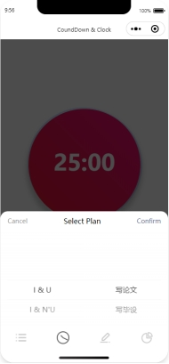

# 使用手册

## 配置云开发环境

env: '' 里面的内容需要自己配置一下

## 创建数据表

在云开发里面的数据库新建这个6个集合即可，小程序会自动添加记录

## 云函数中邮件参数设置

被涂去的地方就是需要修改成自己的。

auth.user 要和 mail.form里面邮件内容一致！！！

邮箱的授权码需要在QQ邮箱里面开启SMTP。

## 效果展示

## 体验

微信搜索小程序：Muse ToDo

